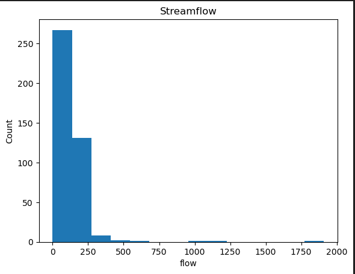
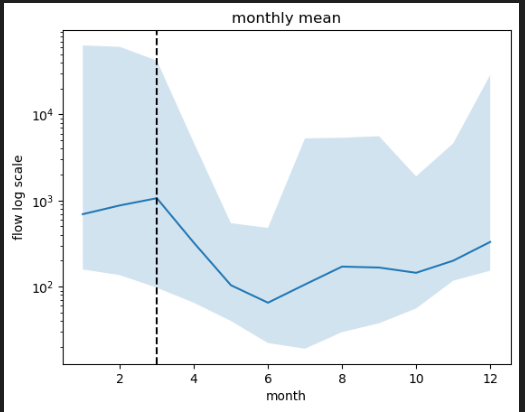
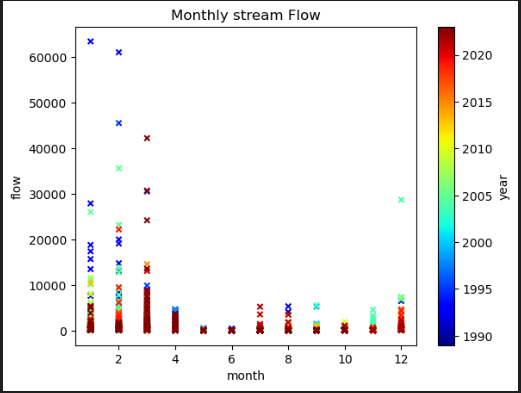
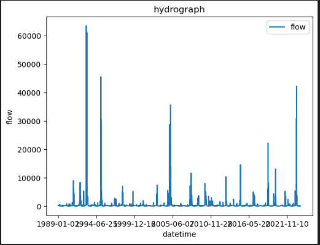

1. I am guessing that the cfs for next week is 70. 
2.  I chose flow vs count to create a histogram of the data. 
3.  I used a log scale scale is shows large scales of a value in compact form.
4.  I have a scatterplot showing the monthly flow with years plotted on the xy graph. It shows the correlation between the years in a visually distinguishable way.
5.  This is just a simple hydrograph showing the montly flow with the data. 
6. I think that I have made some progres so far but I have  aways to go. I will spend the extra time I have on the weekends watching videos and trying to write some extra code. I had a lot of trouble with the for loops and I have trouble using pandas. I will keep working at it though. 
7. ../../Homework_Working/week7HW.py