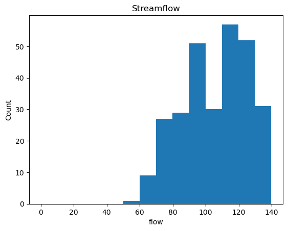
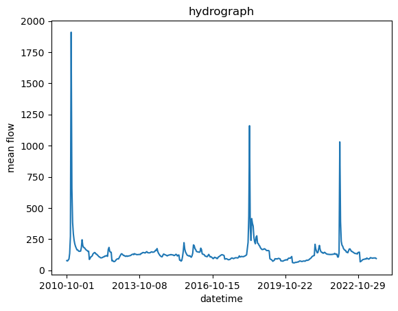

Your submission folder should include a markdown file that contains the following:
1. Your forecast numbers and a brief summary of how you generated them.
   1. I believe that I did not submit the forecasts for this week. But I would have tried using my graphs and gone with 95, 80. 
2. The two graphs you created along with an explanation on what each shows and how it supports your forecast decision. 
    - this graph is the mean flow plotted against the count. So, my prediction based off of lower end of the mean flow since this year has been dryer than other years.
    - this is a hydrograph of the date vs mean flow. I used the mean flow value for my predictions for this year. 
3. A reflection on things that are going well and issues that you are having. 
   1. Troubleshooting has always been an issue for me. I think that I am getting better at finding external resources to help me figure out the assignemnts. 